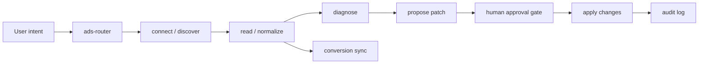

# Shared Ads Workflow

Shared routing and safety rules for the ad skill family.

Use this file when a task touches any ad platform and you need the common model before platform-specific work.

## Core Rule

Do not treat ad management as a single free-form agent task.

Split it into five stages:

1. connect account
2. read data
3. normalize
4. diagnose and propose
5. approve and apply

This family should always keep those stages separate.

## Default Flow

## Safety Rules

- Keep read and write paths separate.
- Require explicit approval before any spend-affecting write.
- Treat account binding, token storage, and billing as sensitive operations.
- Prefer dry-run or validation-only mode before real execution.
- Never let the model call the platform API directly without a deterministic adapter layer.

## Common Roles

### `ads-router`

- classify intent
- decide whether the request is connect, read, diagnose, propose, apply, or sync
- route to the correct platform adapter

### `ads-core`

- own the normalized ad schema
- own the approval record schema
- own the audit and execution record schema

### `ads-read`

- pull accounts, campaigns, ad groups, ads, creatives, budgets, reports, and conversion summaries
- never mutate

### `ads-diagnose`

- identify wasted spend, fatigue, unstable CPA, budget constraints, and broken tracking
- output reasons, not commands

### `ads-propose`

- produce a structured patch for review
- keep proposed changes small and explicit

### `ads-apply`

- execute only approved changes
- keep a full result record

### `ads-conversion-sync`

- send server-side events or conversion signals back to the platform
- treat this as an execution path with tracking and audit

## Shared Output Contract

All platform-specific skills should be able to return at least:

- `access_scope`
- `account_tree`
- `normalized_reports`
- `diagnosis`
- `proposed_patch`
- `approval_record`
- `execution_result`
- `audit_log`

## Platform Policy

Each platform adapter should declare:

- auth method
- readable objects
- writable objects
- conversion sync support
- expected rate-limit behavior
- known policy or access caveats

## First Version Boundary

The first version should support:

- connect
- read
- normalize
- diagnose
- propose
- manual approve
- apply a small safe action set

The first version should not try to automate:

- full campaign generation from scratch
- unrestricted budget allocation
- multi-account spend migration
- self-directed creative replacement

