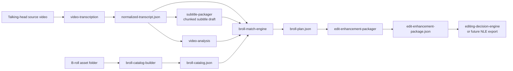

# B-roll Skill Architecture

This document defines the first version of the B-roll editing skill family for talking-head post-production.

It assumes the subtitle foundation already exists:

- raw video
- normalized transcript
- chunked subtitle draft
- ASS profile and preview flow

## Goal

After subtitles are in place, the next editing question is:

- where should the edit stay on A-roll
- where should it cut to B-roll
- which B-roll should be used
- which words or claims deserve stronger visual support
- where micro-animation or keyword reinforcement should appear

This family should answer those questions in a structured way.

## System Layers

## Roles

### Existing Skills

`video-transcription`

- produces a stable transcript timeline

`subtitle-packager`

- turns transcript into reading-ready subtitle chunks

`video-analysis`

- explains the spoken structure and visual logic of the A-roll

`frame-extraction`

- extracts proof frames, UI frames, or contact sheets from source clips

`editing-decision-engine`

- decides beat-by-beat edit intent and packaging

### New Skills In This Family

`broll-catalog-builder`

- builds a usable semantic inventory of B-roll assets

`broll-match-engine`

- maps spoken beats to candidate B-roll, proof types, and coverage suggestions

`edit-enhancement-packager`

- turns B-roll matches into editor-ready attention, keyword, micro-motion, and subtitle treatment cues

## Why This Split Matters

Do not try to match B-roll directly from a raw folder and a raw transcript in one step.

That creates three problems:

1. no reusable asset inventory
2. no stable place to improve matching quality
3. no clean boundary between asset understanding and edit decision logic

The catalog layer is the stable asset mother file.

The match layer is the stable edit-planning bridge.

## First-Version Artifacts

The minimum viable B-roll family should produce:

- `broll-catalog.json`
- optional B-roll contact sheets or frame manifests
- `broll-plan.json`
- optional markdown review summary

Do not require in v1:

- direct CapCut draft generation
- Premiere XML
- automatic timeline rendering
- automatic motion graphics rendering

## Decision Flow

The intended decision order is:

1. identify edit beats from transcript and subtitle chunking
2. identify what each beat needs visually
3. identify what each B-roll asset can prove
4. match beats to candidate assets
5. attach packaging hints such as keyword emphasis or motion cues

This keeps the system explainable.

## Visual Support Taxonomy

Each beat should be expressible in one of a small set of support needs:

- `proof`
- `ui-demo`
- `workflow-bridge`
- `pace-reset`
- `keyword-emphasis`
- `comparison`
- `transition-cover`
- `cta-support`

Each B-roll asset should also be tagged by what it can support.

That creates the bridge between language and footage.

## Suggested Phase Plan

### Phase 1

Build `broll-catalog-builder`.

Output a good asset inventory before trying to automate matching.

### Phase 2

Build `broll-match-engine`.

Output candidate matches, not final hard commits.

### Phase 3

Add `edit-enhancement-packager`.

Attach:

- keyword overlays
- micro-motion hints
- A-roll vs B-roll staying logic
- subtitle density adjustments

### Phase 4

Only after the planning package is stable, consider an export layer:

- CapCut draft
- Premiere/FCP XML
- timeline JSON

## Review Standard

The family is working if a human editor can answer these from the output:

- which beats require B-roll
- which asset is the best candidate for each beat
- which B-roll is optional vs essential
- where the video should stay on face
- where extra emphasis or motion would help

If the output cannot guide a real editor, the family is still too abstract.
